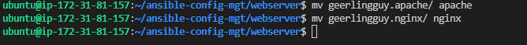

# Documentation of project 13

1. I created a new directory in my repository and named it "dynamic-assignments"
   
   

2. I created 'mysql role'

   

3. I renamed the role

   

4. Contents of mysql role

   

5. I pushed it to my github repository

   

6. I installed 'nginx' role

   

7. I installed 'apache' role

   

8. I renamed 'apache' and 'nginx' role

   

9.  I pushed the new changes to my github account

   

10. I edited the necesssary files

11. Then I ran my ansible-playbook command

  
  
  
  
  
  
  

12. Here are some files I edited

   
   
   
   
